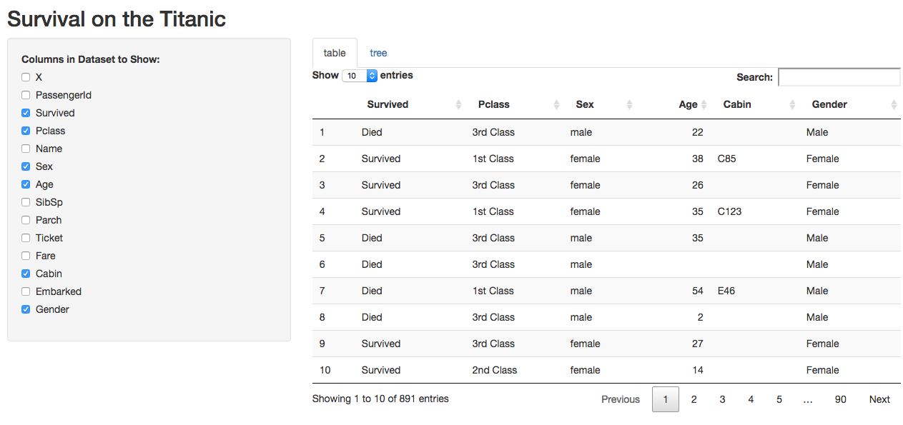
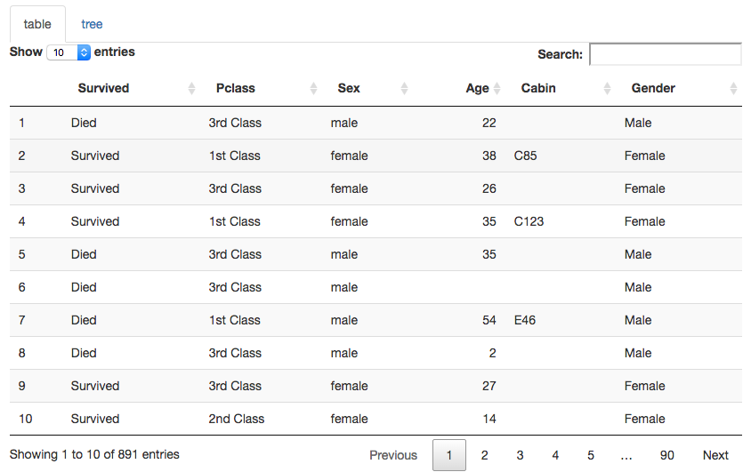
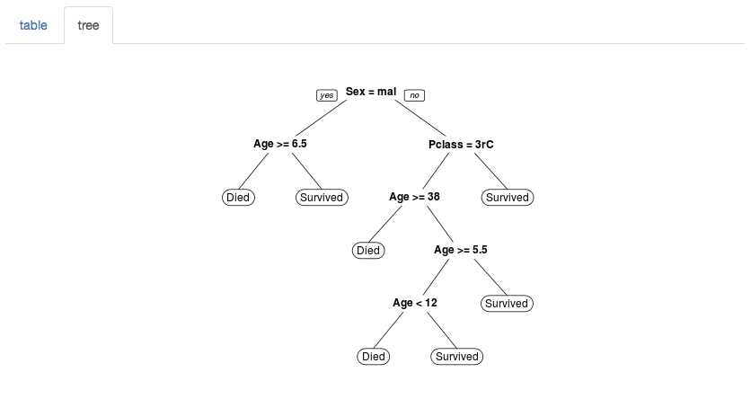

<style type='text/css'>
img {
    max-height: 380px;
    max-width: 964px;
}
</style>

<!-- Center image on slide -->
<script src="http://ajax.aspnetcdn.com/ajax/jQuery/jquery-1.7.min.js"></script>
<script type='text/javascript'>
$(function() {
    $("p:has(img)").addClass('centered');
});
</script>

## Variable Selection in Kaggle Titanic Dataset

This presentation is part of the project for the course in data products of the Data-Science Specialization on Coursera.

The project is a shiny server application who provide the user a easy way to see the data in the titanic dataset, an a simple way to train a classification tree, selecting the desired variables in the dataset.



---
## Kaggle Titanic Dataset

The dataset is obtained from the Kaggle titanic competition at https://www.kaggle.com/c/titanic/ this consist of two dataset, the *train* dataset and the *test*. The last one without the output variable. 

The dataset indicate when a passenger of the titanic survived to the accident and a series of characteristic of the passengers.

We realized only a minor preprocessing to the original data, there are many data enginnering procedures suggested in the kaggle site, but for the propurse of this work are not necesary.


```r
train <- read.csv("data/train.csv")
train$Survived <- factor(train$Survived, levels=c(1,0))
levels(train$Survived) <- c("Survived", "Died")
train$Pclass <- as.factor(train$Pclass)
levels(train$Pclass) <- c("1st Class", "2nd Class", "3rd Class")
train$Gender <- factor(train$Sex, levels=c("female", "male"))
levels(train$Gender) <- c("Female", "Male")
```

---
## Table Visualization

One tab of the application show all the data using datatables:


```r
shinyServer(function(input, output) {
  ...
  output$table <- DT::renderDataTable({
    DT::datatable(titanic[, input$show_vars, drop = FALSE])
  })
  ...
```


---

## Tree Visualization

The other tab show the tree visualization of the adjusted model



---
## Conclusions

* Shiny and shinyapps provide a easy way to share data products
* Slidify is a powerful tool to share and present code and models
* We face a problem when we try to produce a more beautiful plot for the model, When we try to use fancyRpartPlot shinyapps don't allow to use because this require gtk. This is a limitation not faced in the local shiny server.

---


